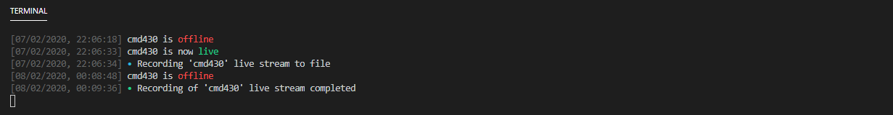

# Twitch Stream Recorder

> Automatically record live streams from Twitch

---

 
> Example of application output
---

## Table of Contents
- [Prerequisites](#prerequisites)
- [Installation](#installation)
- [Features](#features)
- [License](#license)

---

# Prerequisites
- [Node `version >= 13`](https://nodejs.org/en/download/current/)
- [Git](https://git-scm.com/downloads)
- A small amount of command line knowledge

---

# Installation
> *It is Recommended to begin in the directory you will be keeing the application*

#### Clone
  ```bash
  $ git clone https://github.com/cmd430/twitch-stream-recorder
  ```


#### Setup
> Change into the newly created directory and install dependencies
  ```bash
  $ cd twitch-stream-recorder
  $ npm i --only=prod
  ```
- Edit `config.json` with your desired preferences  
  > For most use cases only the `Streamer` and `timezone` needs to be changed

#### Run the Program
> *Any of the following methods may be used*
  ```bash
  $ node index [cmd args]
  $ npm run start
  or just run the `Twitch Stream Recorder.[cmd|sh]` file
  ```
- You can use `node index --help` to see all cmd args and their default values
  > cmd args will override settings specified in the `config.json`

---

# Features
- Monitor streamer and automatically record to disk when live
  - streams are saved by default with the name following naming format:  
   `./recordings/:year/:month/:shortYear.:month.:day :period -- :title.mp4`
- `config.json` to save settings
- Command line args to override settings on a per run basis

---

# License
THE SOFTWARE IS PROVIDED "AS IS", WITHOUT WARRANTY OF ANY KIND, EXPRESS OR IMPLIED, INCLUDING BUT NOT LIMITED TO THE WARRANTIES OF MERCHANTABILITY, FITNESS FOR A PARTICULAR PURPOSE AND NONINFRINGEMENT. IN NO EVENT SHALL THE AUTHORS OR COPYRIGHT HOLDERS BE LIABLE FOR ANY CLAIM, DAMAGES OR OTHER LIABILITY, WHETHER IN AN ACTION OF CONTRACT, TORT OR OTHERWISE, ARISING FROM, OUT OF OR IN CONNECTION WITH THE SOFTWARE OR THE USE OR OTHER DEALINGS IN THE SOFTWARE.

[Full MIT License](LICENSE.md)
